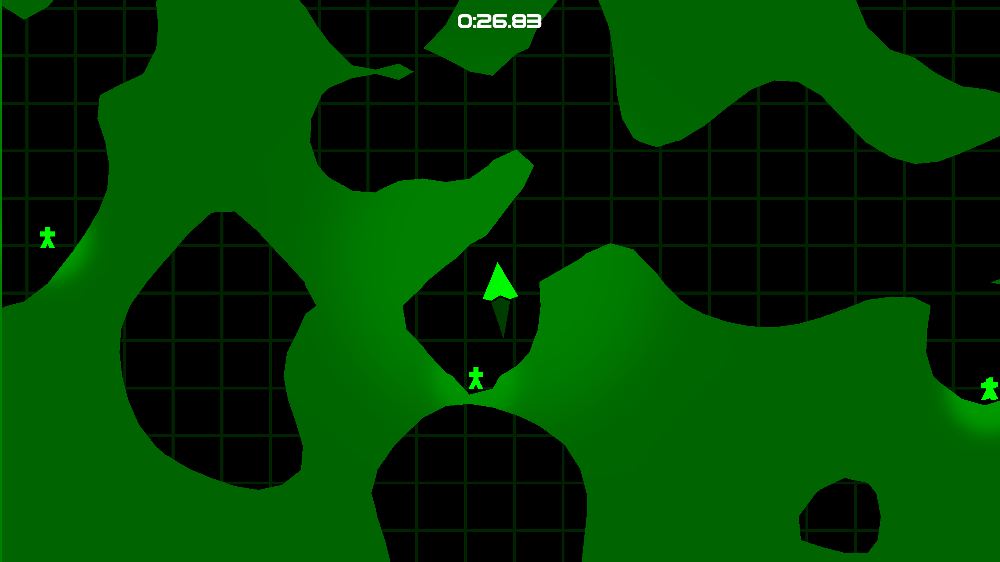

SAVE THE LAST HUMANS
====================

This is my entry to [SuomiGameHub Summer Jam 2025](https://itch.io/jam/sgh-kesajami-2025). The idea was to take a classic Finnish game and make an own version of it in one weekend. My game is inspired by classic Finnish cave flying games from the 90s like Wings, Auts, and Kops and as you might guess from the name, also Housemarque's Resogun (2013).

The game is [playable and downloadable on Itch.io](https://fractilegames.itch.io/save-the-last-humans).

This is a [Godot Engine](https://godotengine.org/download/3.x/linux/) 3.6.1 project. There are export presets set up for Linux, Windows and HTML5.

License
-------

The project code is licensed under the MIT license. Assets are CC0 except for the font and the generated voices. See attributions below for links to more information.

Attributions
------------

The destructible terrain is based on [terrain component by Miles Turin](https://github.com/milesturin/Godot-Destructable-Terrain/).

Used font is Vudotronic by Allison James ([from DaFont](https://www.dafont.com/vudotronic.font)).

Sound effects are from [freesound.org](https://freesound.org/) (CC0 only). Voices are made by [TTSMaker](https://ttsmaker.com).

